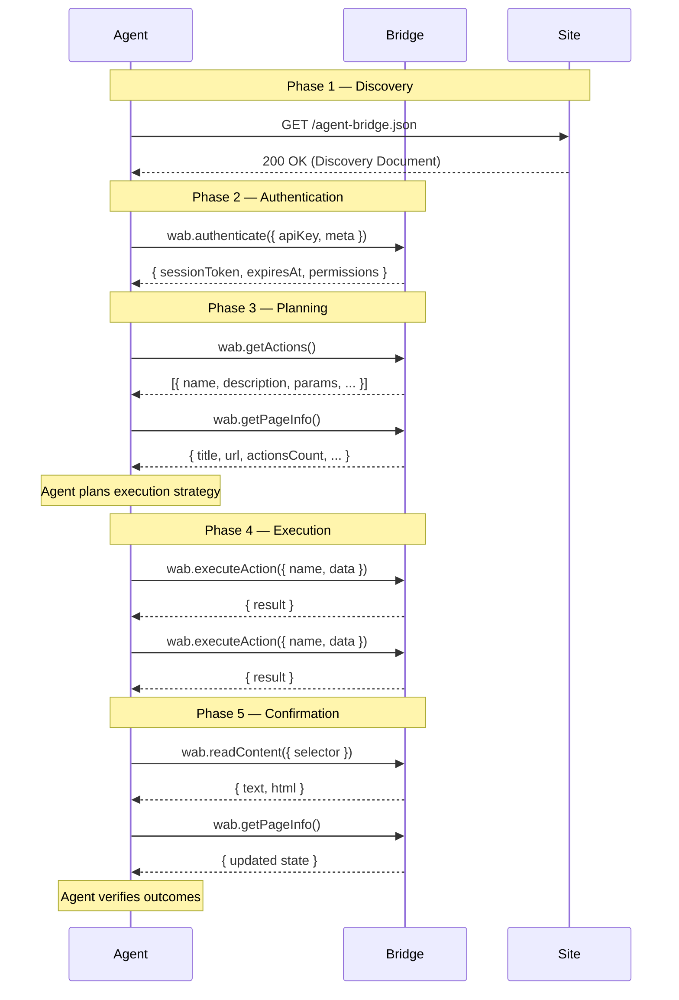

# WAB Protocol Specification

**Version:** 1.0  
**Status:** Draft  
**Date:** 2026-03-25  
**Authors:** Web Agent Bridge Contributors  
**License:** MIT  
**Repository:** [github.com/abokenan444/web-agent-bridge](https://github.com/abokenan444/web-agent-bridge)

---

## Table of Contents

1. [Abstract](#1-abstract)
2. [Terminology](#2-terminology)
3. [Protocol Overview](#3-protocol-overview)
4. [Discovery Protocol](#4-discovery-protocol)
5. [Command Protocol](#5-command-protocol)
6. [Lifecycle Protocol](#6-lifecycle-protocol)
7. [Transport Layers](#7-transport-layers)
8. [Security Model](#8-security-model)
9. [Fairness Protocol](#9-fairness-protocol)
10. [MCP Compatibility](#10-mcp-compatibility)
11. [Conformance](#11-conformance)
12. [Appendix A: JSON Schema for agent-bridge.json](#appendix-a-json-schema-for-agent-bridgejson)
13. [Appendix B: Error Codes](#appendix-b-error-codes)
14. [Appendix C: MIME Types and Headers](#appendix-c-mime-types-and-headers)

---

## 1. Abstract

The **Web Agent Bridge (WAB) Protocol** is an open protocol that enables AI agents to interact with websites through a standardized command interface. Where `robots.txt` tells bots what they *cannot* do, WAB tells AI agents what they *can* do — and exactly how to do it.

WAB functions as **OpenAPI for human-facing pages**. Website owners publish a machine-readable discovery document describing the actions, permissions, and entry points their site exposes. AI agents consume this document, authenticate, and execute commands through a uniform request/response protocol — eliminating the need for DOM scraping, fragile selectors, or reverse-engineered APIs.

The protocol is transport-agnostic. A single command schema works identically across in-browser JavaScript globals, WebSocket connections, and HTTP REST endpoints. This allows the same agent logic to operate inside a browser tab, from a remote orchestrator, or within a server-to-server pipeline.

### Design Goals

- **Declarative:** Sites declare capabilities; agents discover them at runtime.
- **Secure:** Every interaction is scoped by permissions, rate limits, and session tokens.
- **Fair:** A neutrality layer ensures small and large sites receive equal agent visibility.
- **Interoperable:** WAB maps cleanly onto MCP (Model Context Protocol) for LLM tool use.
- **Simple:** A minimal conforming implementation requires only a JSON file and a `<script>` tag.

### Notational Conventions

The key words "MUST", "MUST NOT", "REQUIRED", "SHALL", "SHALL NOT", "SHOULD", "SHOULD NOT", "RECOMMENDED", "MAY", and "OPTIONAL" in this document are to be interpreted as described in [RFC 2119](https://www.ietf.org/rfc/rfc2119.txt).

---

## 2. Terminology

| Term | Definition |
|---|---|
| **Agent** | An autonomous or semi-autonomous software entity (typically AI-powered) that discovers, plans, and executes actions on websites via the WAB protocol. |
| **Bridge** | The runtime layer on a website that exposes the WAB interface. In the reference implementation this is the `ai-agent-bridge.js` script that creates `window.AICommands`. |
| **Site Owner** | The person or organization that deploys the Bridge on their website and configures its discovery document, permissions, and actions. |
| **Discovery Document** | A JSON file (`agent-bridge.json` or `/.well-known/wab.json`) that describes a site's WAB capabilities, permissions, transport options, and metadata. |
| **Command** | A structured JSON message sent by an Agent to a Bridge requesting a specific operation. |
| **Action** | A named capability exposed by a Bridge (e.g., `search`, `addToCart`, `signup`). Actions are registered by the Site Owner and discovered by Agents at runtime. |
| **Transport** | The communication channel over which Commands flow between Agent and Bridge. WAB defines three transports: JavaScript Global, WebSocket, and HTTP REST. |
| **Session** | A time-bounded, authenticated context linking an Agent to a Bridge. Sessions are identified by tokens and scoped by permissions. |
| **Tier** | The subscription level governing which features and rate limits apply to a site's Bridge instance. Standard tiers are `free`, `starter`, `pro`, and `enterprise`. |
| **Selector** | A CSS selector string identifying a DOM element. Bridges use selectors to map Actions to page elements. |
| **BiDi Interface** | The WebDriver BiDi-compatible interface exposed at `window.__wab_bidi` for structured command exchange within a browser context. |

---

## 3. Protocol Overview

### 3.1 Architecture

WAB is organized into three layers:

```
┌─────────────────────────────────────────┐
│           Protocol Layer (Spec)         │  ← This document
│  Discovery · Commands · Lifecycle       │
├─────────────────────────────────────────┤
│           Runtime Layer (JS SDK)        │  ← ai-agent-bridge.js / WABAgent SDK
│  Bridge · Actions · Permissions · Logs  │
├─────────────────────────────────────────┤
│         Transport Layer (Wire)          │  ← JS Global / WebSocket / HTTP
│  window.AICommands · ws:// · /api/wab   │
└─────────────────────────────────────────┘
```

**Protocol Layer** defines the abstract data formats, lifecycle phases, and conformance requirements. It is implementation-agnostic.

**Runtime Layer** is a concrete JavaScript SDK that implements the Protocol Layer. The reference implementation provides `ai-agent-bridge.js` (site-side Bridge) and `WABAgent` (agent-side SDK).

**Transport Layer** carries serialized Commands and Responses between Agent and Bridge. All three transports MUST implement the identical Command Protocol defined in [Section 5](#5-command-protocol).

### 3.2 Lifecycle Summary

Every WAB interaction follows a five-phase lifecycle:

```
Discover → Authenticate → Plan → Execute → Confirm
```

1. **Discover** — Agent locates and parses the site's Discovery Document.
2. **Authenticate** — Agent establishes a Session with the Bridge.
3. **Plan** — Agent reads available Actions and determines an execution strategy.
4. **Execute** — Agent sends Commands to perform Actions.
5. **Confirm** — Agent verifies the results of executed Commands.

Each phase is detailed in [Section 6](#6-lifecycle-protocol).

### 3.3 Design Principles

1. **Opt-in only.** No site is WAB-enabled unless the Site Owner explicitly deploys a Bridge.
2. **Least privilege.** Agents receive only the permissions the Site Owner grants.
3. **Transport symmetry.** A Command sent over HTTP MUST produce the same result as the same Command sent over WebSocket or the JS global.
4. **Graceful degradation.** If a transport is unavailable, the Agent SHOULD fall back to an alternative transport listed in the Discovery Document.
5. **Neutrality.** The protocol includes a Fairness Protocol ([Section 9](#9-fairness-protocol)) to prevent concentration of agent traffic.

---

## 4. Discovery Protocol

### 4.1 Discovery Document Location

A WAB-enabled site MUST serve its Discovery Document at one or both of the following locations:

| Priority | URL | Content-Type |
|---|---|---|
| 1 (primary) | `https://{host}/agent-bridge.json` | `application/json` |
| 2 (fallback) | `https://{host}/.well-known/wab.json` | `application/json` |

An Agent MUST attempt the primary URL first. If it returns a non-2xx status, the Agent SHOULD attempt the fallback URL. If both fail, the site MUST be treated as non-WAB-enabled.

The Discovery Document MAY also be referenced via an HTML `<meta>` tag:

```html
<meta name="wab-discovery" content="/agent-bridge.json">
```

### 4.2 Discovery Document Format

The Discovery Document is a JSON object with the following top-level fields:

```json
{
  "wab_version": "1.0",
  "provider": {
    "name": "Acme Restaurant",
    "category": "restaurant",
    "url": "https://acme-restaurant.com",
    "location": {
      "city": "Amman",
      "country": "JO",
      "support_local": true
    }
  },
  "capabilities": {
    "commands": [
      {
        "name": "viewMenu",
        "description": "View the restaurant menu",
        "trigger": "navigate",
        "params": [],
        "requiresAuth": false
      },
      {
        "name": "placeOrder",
        "description": "Place a food order",
        "trigger": "fill_and_submit",
        "params": [
          { "name": "items", "type": "array", "required": true, "description": "List of menu item IDs" },
          { "name": "address", "type": "string", "required": true, "description": "Delivery address" }
        ],
        "requiresAuth": true
      },
      {
        "name": "searchMenu",
        "description": "Search menu items by keyword",
        "trigger": "api",
        "params": [
          { "name": "query", "type": "string", "required": true, "description": "Search term" }
        ],
        "requiresAuth": false
      }
    ],
    "permissions": {
      "readContent": true,
      "click": true,
      "fillForms": true,
      "scroll": true,
      "navigate": false,
      "apiAccess": true,
      "automatedLogin": false,
      "extractData": false
    },
    "tier": "starter"
  },
  "agent_access": {
    "preferred_entry_point": "/menu",
    "api_fallback": "https://api.acme-restaurant.com/v1",
    "selectors": {
      "menu": "#main-menu",
      "cart": "#shopping-cart",
      "searchInput": "input[name='search']",
      "orderForm": "#order-form"
    }
  },
  "fairness_metrics": {
    "commission_rate": "0%",
    "direct_benefit": "Orders go directly to the restaurant",
    "is_independent": true
  },
  "trust_signatures": [
    "sha256:abc123...",
    "wab-registry:verified"
  ],
  "transport": {
    "js_global": {
      "enabled": true,
      "interface": "window.AICommands"
    },
    "websocket": {
      "enabled": true,
      "url": "wss://acme-restaurant.com/ws/wab"
    },
    "http": {
      "enabled": true,
      "base_url": "/api/wab"
    }
  },
  "security": {
    "require_origin_match": true,
    "session_ttl": 3600,
    "max_rate": 60
  }
}
```

### 4.3 Field Definitions

#### 4.3.1 `wab_version` (REQUIRED)

A string indicating the WAB protocol version. For this specification, the value MUST be `"1.0"`.

#### 4.3.2 `provider` (REQUIRED)

Metadata about the site and its owner.

| Field | Type | Required | Description |
|---|---|---|---|
| `name` | string | REQUIRED | Human-readable name of the site or business. |
| `category` | string | REQUIRED | Business category (e.g., `"restaurant"`, `"ecommerce"`, `"saas"`, `"news"`). |
| `url` | string | REQUIRED | Canonical URL of the site. |
| `location` | object | OPTIONAL | Physical location. Contains `city` (string), `country` (ISO 3166-1 alpha-2), and `support_local` (boolean). |

#### 4.3.3 `capabilities` (REQUIRED)

Describes what the Bridge can do.

| Field | Type | Required | Description |
|---|---|---|---|
| `commands` | array | REQUIRED | List of Action definitions. See [Section 4.4](#44-action-definition). |
| `permissions` | object | REQUIRED | Map of permission names to booleans. See [Section 4.5](#45-permissions). |
| `tier` | string | OPTIONAL | Subscription tier: `"free"`, `"starter"`, `"pro"`, or `"enterprise"`. Defaults to `"free"`. |

#### 4.3.4 `agent_access` (RECOMMENDED)

Hints for agents on how to interact with the site.

| Field | Type | Required | Description |
|---|---|---|---|
| `preferred_entry_point` | string | OPTIONAL | URL path the agent SHOULD navigate to first. |
| `api_fallback` | string | OPTIONAL | Base URL for a REST API the agent MAY use when DOM interaction is unavailable. |
| `selectors` | object | OPTIONAL | Map of logical names to CSS selectors for key page elements. |

#### 4.3.5 `fairness_metrics` (RECOMMENDED)

Transparency data for the Fairness Protocol ([Section 9](#9-fairness-protocol)).

| Field | Type | Required | Description |
|---|---|---|---|
| `commission_rate` | string | OPTIONAL | Commission charged to the site (e.g., `"0%"`, `"15%"`). |
| `direct_benefit` | string | OPTIONAL | Human-readable description of how the site benefits. |
| `is_independent` | OPTIONAL | boolean | Whether the site is independently owned. |

#### 4.3.6 `trust_signatures` (OPTIONAL)

An array of strings representing cryptographic or registry-based trust attestations. Agents MAY use these to verify the authenticity of the Discovery Document.

#### 4.3.7 `transport` (REQUIRED)

Declares available Transport Layers. At least one transport MUST be enabled.

| Field | Type | Description |
|---|---|---|
| `js_global.enabled` | boolean | Whether the JS global interface is available. |
| `js_global.interface` | string | Global variable name (default: `"window.AICommands"`). |
| `websocket.enabled` | boolean | Whether a WebSocket endpoint is available. |
| `websocket.url` | string | Full WebSocket URL. |
| `http.enabled` | boolean | Whether an HTTP REST endpoint is available. |
| `http.base_url` | string | Base URL path for the HTTP transport. |

#### 4.3.8 `security` (RECOMMENDED)

| Field | Type | Default | Description |
|---|---|---|---|
| `require_origin_match` | boolean | `true` | Whether the Bridge validates the requesting origin. |
| `session_ttl` | integer | `3600` | Session lifetime in seconds. |
| `max_rate` | integer | `60` | Maximum commands per minute per session. |

### 4.4 Action Definition

Each entry in `capabilities.commands` MUST conform to:

| Field | Type | Required | Description |
|---|---|---|---|
| `name` | string | REQUIRED | Unique action identifier (alphanumeric, hyphens, underscores). |
| `description` | string | REQUIRED | Human-readable description of the action. |
| `trigger` | string | REQUIRED | Execution method. One of: `"click"`, `"fill_and_submit"`, `"scroll"`, `"api"`, `"navigate"`. |
| `params` | array | REQUIRED | Array of parameter definitions (MAY be empty). |
| `requiresAuth` | boolean | OPTIONAL | Whether the action requires an authenticated session. Defaults to `false`. |

Each parameter definition:

| Field | Type | Required | Description |
|---|---|---|---|
| `name` | string | REQUIRED | Parameter name. |
| `type` | string | REQUIRED | JSON Schema type: `"string"`, `"number"`, `"boolean"`, `"array"`, `"object"`. |
| `required` | boolean | REQUIRED | Whether the parameter is mandatory. |
| `description` | string | RECOMMENDED | Human-readable description. |
| `default` | any | OPTIONAL | Default value if not provided. |
| `enum` | array | OPTIONAL | Allowed values. |

### 4.5 Permissions

The `permissions` object uses the following standard keys:

| Permission | Type | Description |
|---|---|---|
| `readContent` | boolean | Agent MAY read visible text content from the page. |
| `click` | boolean | Agent MAY trigger click events on permitted elements. |
| `fillForms` | boolean | Agent MAY fill and submit form fields. |
| `scroll` | boolean | Agent MAY scroll the page. |
| `navigate` | boolean | Agent MAY navigate to different URLs within the site. |
| `apiAccess` | boolean | Agent MAY call the site's API endpoints. |
| `automatedLogin` | boolean | Agent MAY perform automated authentication flows. |
| `extractData` | boolean | Agent MAY extract and store structured data from the page. |

A Bridge MUST enforce these permissions at runtime. If an Agent attempts an action that requires a permission set to `false`, the Bridge MUST reject the command with error code `PERMISSION_DENIED`.

---

## 5. Command Protocol

### 5.1 Command Format

Every command sent from an Agent to a Bridge MUST conform to the following JSON structure:

```json
{
  "id": "cmd_a1b2c3d4",
  "method": "wab.executeAction",
  "params": {
    "name": "searchMenu",
    "data": {
      "query": "vegetarian"
    }
  },
  "context": {
    "url": "https://acme-restaurant.com/menu",
    "sessionToken": "sess_x9y8z7w6",
    "timestamp": "2026-03-25T12:00:00Z"
  }
}
```

| Field | Type | Required | Description |
|---|---|---|---|
| `id` | string | REQUIRED | Unique identifier for this command. The Bridge MUST echo it in the response. |
| `method` | string | REQUIRED | The WAB method to invoke. See [Section 5.3](#53-standard-methods). |
| `params` | object | REQUIRED | Method-specific parameters. MAY be empty `{}`. |
| `context` | object | OPTIONAL | Execution context. Includes `url`, `sessionToken`, and `timestamp`. |

### 5.2 Response Format

Every response from a Bridge to an Agent MUST conform to:

**Success response:**

```json
{
  "id": "cmd_a1b2c3d4",
  "type": "success",
  "result": {
    "items": [
      { "name": "Falafel Wrap", "price": 5.99 },
      { "name": "Veggie Burger", "price": 8.49 }
    ],
    "total": 2
  }
}
```

**Error response:**

```json
{
  "id": "cmd_a1b2c3d4",
  "type": "error",
  "error": {
    "code": "PERMISSION_DENIED",
    "message": "Action 'placeOrder' requires authentication"
  }
}
```

| Field | Type | Required | Description |
|---|---|---|---|
| `id` | string | REQUIRED | Matches the `id` from the originating command. |
| `type` | string | REQUIRED | Either `"success"` or `"error"`. |
| `result` | object | CONDITIONAL | Present when `type` is `"success"`. Method-specific result data. |
| `error` | object | CONDITIONAL | Present when `type` is `"error"`. Contains `code` and `message`. |

### 5.3 Standard Methods

A conforming WAB Bridge MUST implement the following methods:

#### `wab.discover`

Returns the site's Discovery Document.

- **Params:** None.
- **Result:** The full Discovery Document object.

```json
{ "id": "1", "method": "wab.discover", "params": {} }
```

#### `wab.getContext`

Returns the current Bridge context including version, permissions, and session state.

- **Params:** None.
- **Result:** `{ version, permissions, session, tier, url }`.

```json
{ "id": "2", "method": "wab.getContext", "params": {} }
```

Response:

```json
{
  "id": "2",
  "type": "success",
  "result": {
    "version": "1.0.0",
    "permissions": { "readContent": true, "click": true, "fillForms": false },
    "session": { "authenticated": false, "ttl": 3600 },
    "tier": "free",
    "url": "https://acme-restaurant.com/menu"
  }
}
```

#### `wab.getActions`

Lists all available Actions, optionally filtered by category.

- **Params:** `{ "category": "string" }` (OPTIONAL).
- **Result:** Array of Action definitions.

```json
{ "id": "3", "method": "wab.getActions", "params": { "category": "ordering" } }
```

#### `wab.executeAction`

Executes a named Action with the provided parameters.

- **Params:** `{ "name": "string", "data": {} }` (REQUIRED).
- **Result:** Action-specific result object.

```json
{
  "id": "4",
  "method": "wab.executeAction",
  "params": {
    "name": "placeOrder",
    "data": { "items": ["item_01", "item_02"], "address": "123 Main St" }
  },
  "context": { "sessionToken": "sess_x9y8z7w6" }
}
```

#### `wab.readContent`

Reads the text content of a page element identified by a CSS selector.

- **Params:** `{ "selector": "string" }` (REQUIRED).
- **Result:** `{ "text": "string", "html": "string", "selector": "string" }`.
- **Requires permission:** `readContent`.

```json
{ "id": "5", "method": "wab.readContent", "params": { "selector": "#main-menu" } }
```

#### `wab.getPageInfo`

Returns metadata about the current page and Bridge state.

- **Params:** None.
- **Result:** `{ title, url, description, bridgeVersion, actionsCount, permissions }`.

```json
{ "id": "6", "method": "wab.getPageInfo", "params": {} }
```

Response:

```json
{
  "id": "6",
  "type": "success",
  "result": {
    "title": "Acme Restaurant - Menu",
    "url": "https://acme-restaurant.com/menu",
    "description": "Fresh Mediterranean cuisine",
    "bridgeVersion": "1.0.0",
    "actionsCount": 5,
    "permissions": { "readContent": true, "click": true }
  }
}
```

#### `wab.authenticate`

Authenticates an Agent with the Bridge using an API key or token.

- **Params:** `{ "apiKey": "string", "meta": {} }` (REQUIRED).
- **Result:** `{ "sessionToken": "string", "expiresAt": "ISO 8601", "permissions": {} }`.

```json
{
  "id": "7",
  "method": "wab.authenticate",
  "params": {
    "apiKey": "wab_key_abc123",
    "meta": { "agentName": "ShoppingAssistant", "version": "2.1" }
  }
}
```

Response:

```json
{
  "id": "7",
  "type": "success",
  "result": {
    "sessionToken": "sess_x9y8z7w6",
    "expiresAt": "2026-03-25T13:00:00Z",
    "permissions": { "readContent": true, "click": true, "fillForms": true }
  }
}
```

#### `wab.subscribe`

Subscribes to real-time events from the Bridge. Only available on transports that support push messaging (WebSocket, JS global with event listeners).

- **Params:** `{ "events": ["string"] }` (REQUIRED). Valid events: `"actionExecuted"`, `"permissionChanged"`, `"sessionExpired"`, `"error"`.
- **Result:** `{ "subscriptionId": "string", "events": ["string"] }`.

```json
{
  "id": "8",
  "method": "wab.subscribe",
  "params": { "events": ["actionExecuted", "error"] }
}
```

#### `wab.ping`

Health check. Returns immediately to confirm the Bridge is operational.

- **Params:** None.
- **Result:** `{ "status": "ok", "timestamp": "ISO 8601", "version": "string" }`.

```json
{ "id": "9", "method": "wab.ping", "params": {} }
```

Response:

```json
{
  "id": "9",
  "type": "success",
  "result": { "status": "ok", "timestamp": "2026-03-25T12:00:00Z", "version": "1.0.0" }
}
```

### 5.4 Command ID Generation

Command IDs MUST be unique within a session. Implementations SHOULD use one of:

- UUIDv4 (e.g., `"550e8400-e29b-41d4-a716-446655440000"`)
- Monotonically increasing integers (e.g., `"1"`, `"2"`, `"3"`)
- Prefixed counters (e.g., `"cmd_001"`, `"cmd_002"`)

The Bridge MUST NOT reuse command IDs and MUST reject duplicate IDs within the same session with error code `DUPLICATE_COMMAND_ID`.

---

## 6. Lifecycle Protocol

### 6.1 Lifecycle Phases

Every agent-site interaction follows five ordered phases. Agents MUST complete each phase before advancing to the next.



### 6.2 Phase 1: Discovery

The Agent locates the site's Discovery Document by:

1. Fetching `https://{host}/agent-bridge.json`.
2. If unavailable, fetching `https://{host}/.well-known/wab.json`.
3. Optionally, parsing the HTML `<meta name="wab-discovery">` tag.

The Agent MUST validate the document against the WAB JSON Schema ([Appendix A](#appendix-a-json-schema-for-agent-bridgejson)). If the `wab_version` field indicates a version the Agent does not support, it SHOULD terminate gracefully with an informative error.

The Agent SHOULD cache the Discovery Document for a reasonable duration (RECOMMENDED: 5 minutes). The response MAY include standard HTTP caching headers (`Cache-Control`, `ETag`).

### 6.3 Phase 2: Authentication

If the Discovery Document includes actions where `requiresAuth` is `true`, the Agent MUST authenticate before executing those actions.

1. The Agent sends a `wab.authenticate` command with its API key and optional metadata.
2. The Bridge validates the key and returns a `sessionToken` with an expiration time.
3. The Agent MUST include the `sessionToken` in the `context` field of all subsequent commands.

If no actions require authentication, this phase MAY be skipped. The Bridge MUST still accept unauthenticated commands for actions where `requiresAuth` is `false`.

**Session renewal:** When a session approaches expiration (RECOMMENDED: within 10% of TTL remaining), the Agent SHOULD re-authenticate to obtain a fresh token. The Bridge MUST NOT invalidate the old token until it naturally expires.

### 6.4 Phase 3: Planning

The Agent reads the available actions and Bridge context to formulate an execution plan:

1. Call `wab.getActions()` to retrieve the full list of available actions.
2. Call `wab.getContext()` to understand current permissions and state.
3. Optionally call `wab.getPageInfo()` for page metadata.

The Agent SHOULD filter actions by the permissions granted in the session. The Agent MUST NOT attempt to execute actions for which it lacks the required permissions.

Planning is internal to the Agent. The protocol does not prescribe a planning algorithm — this is where LLM-powered agents apply their reasoning capabilities.

### 6.5 Phase 4: Execution

The Agent sends `wab.executeAction` commands to perform the planned actions:

1. Each command targets a single action by `name`.
2. The `data` field contains the action's required and optional parameters.
3. The Bridge validates the command against the action's parameter schema.
4. The Bridge executes the action (clicking elements, filling forms, calling APIs, etc.).
5. The Bridge returns the result or an error.

**Sequential vs. parallel:** Agents MAY send multiple commands concurrently if the actions are independent. The Bridge MUST process each command atomically. The Bridge SHOULD document in the Discovery Document if certain actions have ordering dependencies.

**Rate limiting:** The Bridge MUST enforce the `max_rate` from the security configuration. If an Agent exceeds the rate limit, the Bridge MUST respond with error code `RATE_LIMITED` and a `Retry-After` value.

### 6.6 Phase 5: Confirmation

After execution, the Agent verifies that the intended outcomes occurred:

1. Call `wab.readContent()` to verify visible page changes.
2. Call `wab.getPageInfo()` to check updated page state.
3. Compare actual results against expected results from the plan.

Confirmation is RECOMMENDED but not strictly required. Agents that skip confirmation accept the risk of undetected failures.

---

## 7. Transport Layers

WAB defines three Transport Layers. Each transport MUST implement the full Command Protocol from [Section 5](#5-command-protocol). A conforming Bridge MUST support at least one transport. A conforming Agent SHOULD support all three.

### 7.1 JavaScript Global Transport

**Identifier:** `js_global`  
**Scope:** In-browser (same page as the Bridge)  
**Interface:** `window.AICommands` and `window.__wab_bidi`

This is the primary transport for agents running inside a browser (Puppeteer, Playwright, browser extensions).

#### 7.1.1 `window.AICommands` (High-Level)

The `AICommands` object exposes convenience methods that map to WAB standard methods:

```javascript
// Get all available actions
const actions = await window.AICommands.getActions();

// Get a specific action
const action = await window.AICommands.getAction('searchMenu');

// Execute an action
const result = await window.AICommands.execute('searchMenu', { query: 'vegetarian' });

// Read page content
const content = await window.AICommands.readContent('#main-menu');

// Get page info
const info = await window.AICommands.getPageInfo();

// Authenticate
const session = await window.AICommands.authenticate('wab_key_abc123', { agentName: 'MyAgent' });
```

All methods MUST return Promises. Errors MUST be thrown as JavaScript `Error` objects with a `code` property matching the WAB error codes ([Appendix B](#appendix-b-error-codes)).

#### 7.1.2 `window.__wab_bidi` (BiDi Protocol)

The BiDi interface provides a lower-level, WebDriver BiDi-compatible transport:

```javascript
const response = await window.__wab_bidi.send({
  id: 1,
  method: 'wab.executeAction',
  params: { name: 'searchMenu', data: { query: 'vegetarian' } }
});
```

The BiDi interface MUST:
- Accept the standard Command format from [Section 5.1](#51-command-format).
- Return the standard Response format from [Section 5.2](#52-response-format).
- Expose a `getContext()` method returning the current Bridge context.
- Support event subscriptions via `subscribe(events, callback)`.

#### 7.1.3 Bridge Readiness

The Bridge MUST signal readiness by dispatching a custom DOM event:

```javascript
window.dispatchEvent(new CustomEvent('wab:ready', {
  detail: { version: '1.0.0', transport: 'js_global' }
}));
```

Agents SHOULD listen for this event or poll for the existence of `window.AICommands` / `window.__wab_bidi`.

### 7.2 WebSocket Transport

**Identifier:** `websocket`  
**Scope:** Remote agents, real-time bidirectional communication  
**URL:** Declared in `transport.websocket.url`

#### 7.2.1 Connection

The Agent establishes a WebSocket connection to the URL specified in the Discovery Document:

```javascript
const ws = new WebSocket('wss://acme-restaurant.com/ws/wab');
```

Upon connection, the Agent SHOULD send a `wab.authenticate` command as the first message if authentication is required.

#### 7.2.2 Message Format

All messages are JSON-encoded text frames. Binary frames MUST NOT be used.

**Agent → Bridge (Command):**

```json
{ "id": "cmd_001", "method": "wab.getActions", "params": {} }
```

**Bridge → Agent (Response):**

```json
{ "id": "cmd_001", "type": "success", "result": [...] }
```

**Bridge → Agent (Push Event):**

```json
{ "id": null, "type": "event", "event": "actionExecuted", "data": { "name": "searchMenu" } }
```

Push events have a `null` id and `type` set to `"event"`.

#### 7.2.3 Connection Lifecycle

- The Bridge SHOULD send a `wab.ping` response every 30 seconds as a heartbeat.
- If the Agent receives no messages for 60 seconds, it SHOULD close and reconnect.
- The Bridge MUST close the connection when the session expires.
- The close frame SHOULD include a reason code: `4001` (session expired), `4002` (rate limited), `4003` (authentication failed).

### 7.3 HTTP REST Transport

**Identifier:** `http`  
**Scope:** Server-to-server, stateless interactions  
**Base URL:** Declared in `transport.http.base_url`

#### 7.3.1 Endpoint Mapping

Each WAB method maps to an HTTP endpoint:

| WAB Method | HTTP Method | Path |
|---|---|---|
| `wab.discover` | GET | `{base}/discover` |
| `wab.getContext` | GET | `{base}/context` |
| `wab.getActions` | GET | `{base}/actions` |
| `wab.executeAction` | POST | `{base}/execute` |
| `wab.readContent` | POST | `{base}/read` |
| `wab.getPageInfo` | GET | `{base}/page-info` |
| `wab.authenticate` | POST | `{base}/authenticate` |
| `wab.subscribe` | POST | `{base}/subscribe` |
| `wab.ping` | GET | `{base}/ping` |

#### 7.3.2 Request Format

**GET requests** pass parameters as query strings:

```http
GET /api/wab/actions?category=ordering HTTP/1.1
Host: acme-restaurant.com
Authorization: Bearer sess_x9y8z7w6
X-WAB-Version: 1.0
```

**POST requests** pass parameters as JSON bodies:

```http
POST /api/wab/execute HTTP/1.1
Host: acme-restaurant.com
Content-Type: application/json
Authorization: Bearer sess_x9y8z7w6
X-WAB-Version: 1.0

{
  "name": "placeOrder",
  "data": { "items": ["item_01"], "address": "123 Main St" }
}
```

#### 7.3.3 Response Format

HTTP responses use standard status codes and return the WAB Response format in the body:

| HTTP Status | WAB Type | Meaning |
|---|---|---|
| 200 | `success` | Command executed successfully. |
| 400 | `error` | Invalid command or parameters. |
| 401 | `error` | Authentication required or failed. |
| 403 | `error` | Permission denied. |
| 404 | `error` | Action not found. |
| 429 | `error` | Rate limited. Includes `Retry-After` header. |
| 500 | `error` | Internal Bridge error. |

#### 7.3.4 Required Headers

| Header | Direction | Required | Description |
|---|---|---|---|
| `X-WAB-Version` | Request | REQUIRED | WAB protocol version (`1.0`). |
| `Authorization` | Request | CONDITIONAL | `Bearer {sessionToken}` for authenticated methods. |
| `Content-Type` | Request | CONDITIONAL | `application/json` for POST requests. |
| `X-WAB-Request-Id` | Request | RECOMMENDED | Unique request ID for tracing. |
| `X-WAB-Request-Id` | Response | RECOMMENDED | Echoed from request. |
| `Retry-After` | Response | CONDITIONAL | Seconds to wait (on 429 responses). |

---

## 8. Security Model

### 8.1 Permission Model

The Bridge enforces a layered permission model:

1. **Discovery-level permissions** — Declared in `capabilities.permissions`. These are the maximum permissions the site grants.
2. **Session-level permissions** — Returned in the `wab.authenticate` response. These MAY be a subset of discovery-level permissions based on the Agent's tier or API key.
3. **Action-level requirements** — Each action's `requiresAuth` field determines whether a session is needed.

Permission enforcement is multiplicative: an action is permitted only if ALL applicable permission layers allow it.

### 8.2 Sandbox Execution

Commands that trigger DOM interactions (click, fill, scroll) MUST be executed within a security sandbox:

1. **Selector validation:** The Bridge MUST verify that the target selector is not in the `blockedSelectors` list and, if `allowedSelectors` is non-empty, is in the `allowedSelectors` list.
2. **Action isolation:** Each action MUST be executed atomically. A failure in one action MUST NOT corrupt the state of other pending actions.
3. **Output sanitization:** The Bridge MUST sanitize all content returned via `wab.readContent` to prevent injection attacks (strip `<script>` tags, event handlers, etc.).

### 8.3 Audit Logging

A conforming Bridge SHOULD maintain an audit log of all commands received and responses sent. Each log entry MUST include:

| Field | Description |
|---|---|
| `timestamp` | ISO 8601 timestamp. |
| `commandId` | The command's `id` field. |
| `method` | The WAB method invoked. |
| `agentId` | Identifier for the Agent (from session or API key). |
| `origin` | The requesting origin (for JS global and HTTP transports). |
| `status` | `"success"` or `"error"`. |
| `errorCode` | Error code if applicable. |
| `latencyMs` | Time to process the command in milliseconds. |

Audit logs SHOULD be retained for at least 30 days. Enterprise-tier implementations MAY retain logs for up to 7 years for compliance purposes.

### 8.4 Session-Based Authentication

Sessions provide the primary authentication mechanism:

1. An Agent authenticates via `wab.authenticate` with an API key.
2. The Bridge returns a `sessionToken` with a bounded TTL (default: 3600 seconds).
3. The Agent includes the token in all subsequent commands.
4. The Bridge MUST reject commands with expired or invalid tokens with error code `SESSION_EXPIRED` or `INVALID_TOKEN`.

Session tokens MUST be:
- At least 128 bits of entropy.
- Opaque to the Agent (no embedded claims that the Agent can decode).
- Transmitted only over secure channels (HTTPS, WSS).

### 8.5 Origin Validation

When `security.require_origin_match` is `true`:

1. The Bridge MUST validate the `Origin` header on HTTP requests.
2. The Bridge MUST validate the `document.referrer` or `window.location` for JS global transport.
3. Commands from non-matching origins MUST be rejected with error code `ORIGIN_MISMATCH`.

### 8.6 Rate Limiting

The Bridge MUST enforce rate limits as declared in `security.max_rate`:

1. Rate limits are per-session (authenticated) or per-origin (unauthenticated).
2. When the limit is exceeded, the Bridge MUST return error code `RATE_LIMITED`.
3. The response MUST include a `retryAfter` field (seconds) or `Retry-After` HTTP header.
4. The Bridge SHOULD use a sliding window algorithm for rate calculation.

### 8.7 Escalation Protection

The Bridge MUST prevent privilege escalation:

1. An Agent MUST NOT gain permissions beyond those granted at authentication.
2. Re-authentication MUST NOT expand permissions without Site Owner configuration change.
3. Session tokens MUST NOT be transferable between Agents.
4. The Bridge MUST detect and reject replayed commands (duplicate `id` within a session).

### 8.8 Command Signing (OPTIONAL)

For high-security environments, the Bridge MAY require command signing:

```json
{
  "id": "cmd_001",
  "method": "wab.executeAction",
  "params": { "name": "transferFunds", "data": { "amount": 100 } },
  "context": { "sessionToken": "sess_abc" },
  "signature": "sha256:e3b0c44298fc1c149afbf4c8996fb92427ae41e4649b934ca495991b7852b855"
}
```

The `signature` field is an HMAC-SHA256 of the canonical JSON representation of `method` + `params`, keyed with a shared secret established during authentication.

---

## 9. Fairness Protocol

### 9.1 The Neutrality Layer

The WAB Fairness Protocol is a unique feature that addresses a critical problem in AI-driven commerce: **the tendency for AI agents to preferentially route traffic to large, well-known brands at the expense of small and independent businesses.**

The Fairness Protocol establishes a set of rules and mechanisms that ensure WAB-enabled sites are treated equitably by AI agents, regardless of the site's size, brand recognition, or advertising budget.

### 9.2 Equal Treatment Requirement

Agents that implement the WAB protocol MUST adhere to the following fairness rules:

1. **No preferential routing.** An Agent MUST NOT preferentially route users to one WAB-enabled site over another based solely on brand size, popularity metrics, or commercial arrangements between the Agent operator and the site.
2. **Capability-based ranking.** When an Agent selects between multiple WAB-enabled sites that can fulfill a user's request, selection MUST be based on **relevance to the user's query**, **capability match** (which site's actions best fulfill the request), and **quality signals** (user ratings, response time, error rate).
3. **Transparency of selection.** An Agent SHOULD be able to explain why it selected one site over another. The explanation MUST reference objective criteria, not commercial relationships.

### 9.3 Discovery Registry

To ensure equal visibility, the WAB ecosystem defines a **Discovery Registry** — a public, decentralized index of WAB-enabled sites:

1. Any site with a valid Discovery Document MAY register with the Discovery Registry.
2. The Registry MUST accept all registrations that pass schema validation and trust verification.
3. The Registry MUST NOT charge differential fees based on site size or traffic volume.
4. Agents SHOULD use the Discovery Registry as their primary source for finding WAB-enabled sites.

Registry entries contain:

```json
{
  "url": "https://acme-restaurant.com",
  "provider": { "name": "Acme Restaurant", "category": "restaurant" },
  "location": { "city": "Amman", "country": "JO" },
  "capabilities_summary": ["viewMenu", "placeOrder", "searchMenu"],
  "fairness_metrics": { "commission_rate": "0%", "is_independent": true },
  "trust_level": "verified",
  "registered_at": "2026-01-15T00:00:00Z"
}
```

### 9.4 Priority Scoring

When multiple sites can fulfill a request, Agents SHOULD use the following scoring model:

| Factor | Weight | Description |
|---|---|---|
| Relevance | 40% | How well the site's capabilities match the user's intent. |
| Proximity | 20% | Geographic proximity to the user (for location-based services). |
| Capability depth | 15% | Number and richness of exposed actions. |
| Quality | 15% | Historical success rate, response time, uptime. |
| Freshness | 10% | How recently the Discovery Document was updated. |

The following factors MUST NOT influence priority:

- Brand recognition or popularity metrics (Alexa rank, domain authority, etc.).
- Paid placement or advertising spend.
- Commercial agreements between the Agent operator and the site.
- Site traffic volume.

### 9.5 Commission Transparency

The `fairness_metrics.commission_rate` field provides transparency about intermediary costs:

1. Sites MUST accurately report their commission rate.
2. Agents SHOULD present commission information to users when relevant (e.g., comparing ordering platforms).
3. Agents SHOULD prefer direct-to-business sites (commission_rate = "0%") when quality and relevance are equal.
4. The `direct_benefit` field SHOULD explain in plain language how the interaction benefits the site owner.

### 9.6 Independent Verification

To prevent gaming of the Fairness Protocol:

1. Discovery Documents MAY be signed with a cryptographic key registered in the Discovery Registry.
2. Third-party auditors MAY verify that Agent implementations comply with the fairness rules.
3. The `trust_signatures` field in the Discovery Document allows sites to present third-party attestations.
4. Agents SHOULD log their site selection decisions for auditability.

### 9.7 Compliance Reporting

Agent operators SHOULD publish periodic fairness reports including:

- Distribution of traffic across site sizes (small / medium / large).
- Percentage of traffic routed to independent vs. chain businesses.
- Average commission rate of selected sites.
- Selection algorithm transparency (open-source or audited).

---

## 10. MCP Compatibility

### 10.1 Overview

The [Model Context Protocol (MCP)](https://modelcontextprotocol.io/) provides a standard interface for LLMs to access external tools, resources, and prompts. WAB is designed to be fully compatible with MCP, enabling WAB-enabled sites to be exposed as MCP tools to any LLM.

### 10.2 WAB → MCP Tool Mapping

Each WAB action maps to an MCP tool:

| WAB Concept | MCP Concept |
|---|---|
| Action | Tool |
| Action name | Tool name |
| Action params | Tool input schema (JSON Schema) |
| Action result | Tool output |
| Discovery Document | Resource |
| Bridge context | Resource |

A WAB action:

```json
{
  "name": "searchMenu",
  "description": "Search menu items by keyword",
  "trigger": "api",
  "params": [
    { "name": "query", "type": "string", "required": true, "description": "Search term" }
  ]
}
```

Maps to an MCP tool:

```json
{
  "name": "acme_restaurant__searchMenu",
  "description": "Search menu items by keyword on Acme Restaurant",
  "inputSchema": {
    "type": "object",
    "properties": {
      "query": { "type": "string", "description": "Search term" }
    },
    "required": ["query"]
  }
}
```

### 10.3 WAB Discovery → MCP Resources

The Discovery Document is exposed as an MCP resource:

```json
{
  "uri": "wab://acme-restaurant.com/discovery",
  "name": "Acme Restaurant WAB Discovery",
  "mimeType": "application/json",
  "description": "WAB capabilities for Acme Restaurant"
}
```

Bridge context is exposed as a second resource:

```json
{
  "uri": "wab://acme-restaurant.com/context",
  "name": "Acme Restaurant Bridge Context",
  "mimeType": "application/json"
}
```

### 10.4 Bidirectional Bridge

A WAB-MCP bridge implementation MUST support both directions:

**WAB → MCP (Site as Tool Provider):**
1. Read the site's Discovery Document.
2. For each action, generate an MCP tool definition.
3. When the LLM calls a tool, translate it to a `wab.executeAction` command.
4. Return the WAB response as the MCP tool output.

**MCP → WAB (LLM as Agent):**
1. The LLM receives WAB tools via MCP.
2. The LLM decides which tool to call based on the user's request.
3. The MCP server translates the tool call to a WAB command.
4. The WAB response is returned to the LLM.

### 10.5 MCP Server Implementation

A reference MCP server for WAB SHOULD implement:

```typescript
interface WABMCPServer {
  // List WAB sites as MCP tools
  listTools(): Tool[];

  // Execute a WAB action via MCP tool call
  callTool(name: string, arguments: object): ToolResult;

  // List WAB discovery documents as MCP resources
  listResources(): Resource[];

  // Read a WAB resource
  readResource(uri: string): ResourceContent;
}
```

The MCP server MUST:
- Namespace tool names to avoid collisions (e.g., `{site}__{action}`).
- Map WAB error codes to MCP error responses.
- Respect WAB rate limits and propagate `Retry-After` information.
- Cache Discovery Documents according to [Section 6.2](#62-phase-1-discovery).

---

## 11. Conformance

### 11.1 Conformance Levels

This specification defines two conformance levels:

| Level | Role | Description |
|---|---|---|
| **WAB Bridge** | Site-side | A site that implements the WAB protocol for agent consumption. |
| **WAB Agent** | Agent-side | An agent that consumes WAB-enabled sites according to the protocol. |

### 11.2 Bridge Conformance Requirements

A conforming WAB Bridge:

1. MUST serve a valid Discovery Document at `/agent-bridge.json` or `/.well-known/wab.json`.
2. MUST support at least one transport layer (JS global, WebSocket, or HTTP).
3. MUST implement all standard methods defined in [Section 5.3](#53-standard-methods).
4. MUST enforce the permission model defined in [Section 8.1](#81-permission-model).
5. MUST enforce rate limits as declared in the Discovery Document.
6. MUST return responses conforming to the Response Format in [Section 5.2](#52-response-format).
7. MUST reject commands with invalid or expired session tokens.
8. MUST use error codes from [Appendix B](#appendix-b-error-codes).
9. SHOULD implement audit logging as described in [Section 8.3](#83-audit-logging).
10. SHOULD implement sandbox execution as described in [Section 8.2](#82-sandbox-execution).
11. MAY implement the WebSocket and HTTP transports in addition to the JS global.
12. MAY implement command signing as described in [Section 8.8](#88-command-signing-optional).

### 11.3 Agent Conformance Requirements

A conforming WAB Agent:

1. MUST discover sites via the Discovery Document before interacting.
2. MUST respect all permissions declared in the Discovery Document.
3. MUST NOT execute actions for which it lacks permission.
4. MUST authenticate before executing actions that require authentication.
5. MUST respect rate limits and honor `Retry-After` directives.
6. MUST follow the lifecycle phases defined in [Section 6](#6-lifecycle-protocol).
7. MUST use the Command Format from [Section 5.1](#51-command-format).
8. SHOULD support all three transport layers.
9. SHOULD implement the Fairness Protocol from [Section 9](#9-fairness-protocol).
10. SHOULD cache Discovery Documents to reduce load on sites.
11. SHOULD implement graceful degradation across transport layers.
12. MAY implement command signing for high-security interactions.

### 11.4 RFC 2119 Requirement Summary

| Keyword | Count | Meaning |
|---|---|---|
| MUST | Core requirements | The implementation is non-conforming if violated. |
| MUST NOT | Prohibitions | The implementation is non-conforming if this occurs. |
| SHOULD | Strong recommendations | May be ignored with good reason, but implications must be understood. |
| SHOULD NOT | Discouraged practices | May be done with good reason, but implications must be understood. |
| MAY | Optional features | Truly optional; implementations may include or omit. |

---

## Appendix A: JSON Schema for agent-bridge.json

```json
{
  "$schema": "https://json-schema.org/draft/2020-12/schema",
  "$id": "https://webagentbridge.com/schemas/agent-bridge.json",
  "title": "WAB Discovery Document",
  "description": "Schema for the Web Agent Bridge discovery document (agent-bridge.json)",
  "type": "object",
  "required": ["wab_version", "provider", "capabilities", "transport"],
  "properties": {
    "wab_version": {
      "type": "string",
      "const": "1.0",
      "description": "WAB protocol version"
    },
    "provider": {
      "type": "object",
      "required": ["name", "category", "url"],
      "properties": {
        "name": { "type": "string", "minLength": 1 },
        "category": { "type": "string", "minLength": 1 },
        "url": { "type": "string", "format": "uri" },
        "location": {
          "type": "object",
          "properties": {
            "city": { "type": "string" },
            "country": { "type": "string", "pattern": "^[A-Z]{2}$" },
            "support_local": { "type": "boolean" }
          }
        }
      }
    },
    "capabilities": {
      "type": "object",
      "required": ["commands", "permissions"],
      "properties": {
        "commands": {
          "type": "array",
          "items": {
            "type": "object",
            "required": ["name", "description", "trigger", "params"],
            "properties": {
              "name": {
                "type": "string",
                "pattern": "^[a-zA-Z][a-zA-Z0-9_-]*$"
              },
              "description": { "type": "string", "minLength": 1 },
              "trigger": {
                "type": "string",
                "enum": ["click", "fill_and_submit", "scroll", "api", "navigate"]
              },
              "params": {
                "type": "array",
                "items": {
                  "type": "object",
                  "required": ["name", "type", "required"],
                  "properties": {
                    "name": { "type": "string" },
                    "type": { "type": "string", "enum": ["string", "number", "boolean", "array", "object"] },
                    "required": { "type": "boolean" },
                    "description": { "type": "string" },
                    "default": {},
                    "enum": { "type": "array" }
                  }
                }
              },
              "requiresAuth": { "type": "boolean", "default": false }
            }
          }
        },
        "permissions": {
          "type": "object",
          "properties": {
            "readContent": { "type": "boolean" },
            "click": { "type": "boolean" },
            "fillForms": { "type": "boolean" },
            "scroll": { "type": "boolean" },
            "navigate": { "type": "boolean" },
            "apiAccess": { "type": "boolean" },
            "automatedLogin": { "type": "boolean" },
            "extractData": { "type": "boolean" }
          }
        },
        "tier": {
          "type": "string",
          "enum": ["free", "starter", "pro", "enterprise"],
          "default": "free"
        }
      }
    },
    "agent_access": {
      "type": "object",
      "properties": {
        "preferred_entry_point": { "type": "string" },
        "api_fallback": { "type": "string", "format": "uri" },
        "selectors": {
          "type": "object",
          "additionalProperties": { "type": "string" }
        }
      }
    },
    "fairness_metrics": {
      "type": "object",
      "properties": {
        "commission_rate": { "type": "string" },
        "direct_benefit": { "type": "string" },
        "is_independent": { "type": "boolean" }
      }
    },
    "trust_signatures": {
      "type": "array",
      "items": { "type": "string" }
    },
    "transport": {
      "type": "object",
      "required": [],
      "properties": {
        "js_global": {
          "type": "object",
          "properties": {
            "enabled": { "type": "boolean" },
            "interface": { "type": "string", "default": "window.AICommands" }
          }
        },
        "websocket": {
          "type": "object",
          "properties": {
            "enabled": { "type": "boolean" },
            "url": { "type": "string", "format": "uri" }
          }
        },
        "http": {
          "type": "object",
          "properties": {
            "enabled": { "type": "boolean" },
            "base_url": { "type": "string" }
          }
        }
      },
      "anyOf": [
        { "properties": { "js_global": { "properties": { "enabled": { "const": true } } } } },
        { "properties": { "websocket": { "properties": { "enabled": { "const": true } } } } },
        { "properties": { "http": { "properties": { "enabled": { "const": true } } } } }
      ]
    },
    "security": {
      "type": "object",
      "properties": {
        "require_origin_match": { "type": "boolean", "default": true },
        "session_ttl": { "type": "integer", "minimum": 60, "default": 3600 },
        "max_rate": { "type": "integer", "minimum": 1, "default": 60 }
      }
    }
  }
}
```

---

## Appendix B: Error Codes

All WAB error responses MUST use one of the following standard error codes:

| Code | HTTP Status | Description |
|---|---|---|
| `INVALID_COMMAND` | 400 | The command is malformed or missing required fields. |
| `INVALID_PARAMS` | 400 | One or more parameters are invalid or missing. |
| `INVALID_METHOD` | 400 | The specified method is not recognized. |
| `AUTHENTICATION_REQUIRED` | 401 | The command requires authentication but no session token was provided. |
| `INVALID_TOKEN` | 401 | The provided session token is invalid. |
| `SESSION_EXPIRED` | 401 | The session token has expired. |
| `PERMISSION_DENIED` | 403 | The Agent lacks permission to perform this action. |
| `ORIGIN_MISMATCH` | 403 | The request origin does not match the allowed origins. |
| `ACTION_NOT_FOUND` | 404 | The specified action name does not exist. |
| `SELECTOR_NOT_FOUND` | 404 | The target DOM element could not be found. |
| `RATE_LIMITED` | 429 | The Agent has exceeded the rate limit. |
| `DUPLICATE_COMMAND_ID` | 409 | A command with this ID was already processed in this session. |
| `SELECTOR_BLOCKED` | 403 | The target selector is in the blocked list. |
| `EXECUTION_FAILED` | 500 | The action was attempted but failed during execution. |
| `BRIDGE_ERROR` | 500 | An internal Bridge error occurred. |
| `TRANSPORT_ERROR` | 502 | The transport layer encountered an error. |
| `TIMEOUT` | 504 | The command timed out before completing. |
| `UNSUPPORTED_VERSION` | 400 | The requested WAB protocol version is not supported by this Bridge. |
| `SANDBOX_VIOLATION` | 403 | The command attempted an operation outside the security sandbox. |
| `SIGNATURE_INVALID` | 401 | The command signature failed verification. |

Error response structure:

```json
{
  "id": "cmd_001",
  "type": "error",
  "error": {
    "code": "RATE_LIMITED",
    "message": "Rate limit exceeded. Maximum 60 requests per minute.",
    "retryAfter": 12
  }
}
```

The `error` object:

| Field | Type | Required | Description |
|---|---|---|---|
| `code` | string | REQUIRED | One of the standard error codes above. |
| `message` | string | REQUIRED | Human-readable error description. |
| `retryAfter` | integer | CONDITIONAL | Seconds to wait before retrying (on `RATE_LIMITED`). |
| `details` | object | OPTIONAL | Additional error context for debugging. |

---

## Appendix C: MIME Types and Headers

### C.1 MIME Types

| MIME Type | Usage |
|---|---|
| `application/json` | Discovery Document, Command/Response bodies. |
| `application/vnd.wab+json` | Formal WAB media type (OPTIONAL). Implementations MAY use this for stricter content negotiation. |
| `text/event-stream` | Server-Sent Events fallback for subscriptions over HTTP (OPTIONAL). |

### C.2 Standard Headers

#### Request Headers

| Header | Required | Description |
|---|---|---|
| `X-WAB-Version` | REQUIRED | Protocol version. Value: `1.0`. |
| `X-WAB-Request-Id` | RECOMMENDED | Unique request identifier (UUIDv4). |
| `X-WAB-Agent-Name` | OPTIONAL | Human-readable name of the Agent. |
| `X-WAB-Agent-Version` | OPTIONAL | Version of the Agent software. |
| `Authorization` | CONDITIONAL | `Bearer {sessionToken}` for authenticated requests. |
| `Content-Type` | CONDITIONAL | `application/json` for POST/PUT requests. |
| `Accept` | RECOMMENDED | `application/json` or `application/vnd.wab+json`. |

#### Response Headers

| Header | Required | Description |
|---|---|---|
| `X-WAB-Version` | REQUIRED | Protocol version supported by the Bridge. |
| `X-WAB-Request-Id` | RECOMMENDED | Echoed from request for correlation. |
| `X-WAB-Rate-Remaining` | RECOMMENDED | Number of requests remaining in the current rate window. |
| `X-WAB-Rate-Reset` | RECOMMENDED | Unix timestamp when the rate window resets. |
| `Retry-After` | CONDITIONAL | Seconds to wait (on 429 responses). |
| `Content-Type` | REQUIRED | `application/json`. |

### C.3 CORS Configuration

Bridges serving the HTTP transport MUST configure CORS headers to allow agent access:

```http
Access-Control-Allow-Origin: *
Access-Control-Allow-Methods: GET, POST, OPTIONS
Access-Control-Allow-Headers: Content-Type, Authorization, X-WAB-Version, X-WAB-Request-Id, X-WAB-Agent-Name, X-WAB-Agent-Version
Access-Control-Expose-Headers: X-WAB-Version, X-WAB-Request-Id, X-WAB-Rate-Remaining, X-WAB-Rate-Reset, Retry-After
Access-Control-Max-Age: 86400
```

If `security.require_origin_match` is `true`, the Bridge SHOULD replace the wildcard `*` with explicit allowed origins.

### C.4 Discovery Document HTTP Headers

When serving the Discovery Document, the server SHOULD include:

```http
Content-Type: application/json
Cache-Control: public, max-age=300
ETag: "v1-abc123"
X-WAB-Version: 1.0
```

---

*End of WAB Protocol Specification v1.0*

*Copyright 2026 Web Agent Bridge Contributors. Licensed under MIT.*
